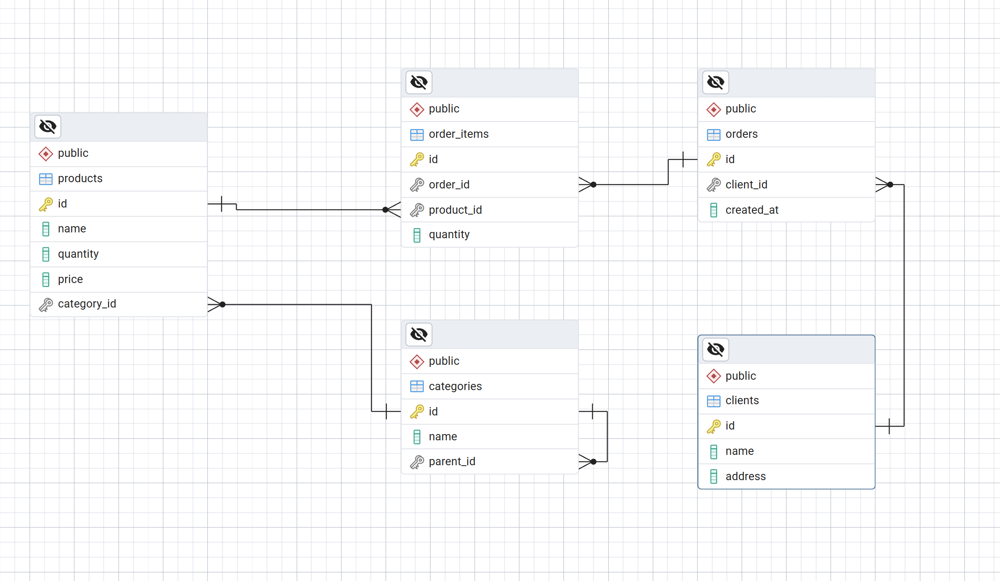

# Сервис добавления товара в заказ

FastAPI сервис для добавления товаров в заказы

## Функционал
- Проверка наличия товара на складе
- Добавление товара в существующий заказ
- Увеличение количества, если товар уже в заказе
- Автоматическое обновление остатков на складе
- Отладочный эндпоинт для проверки данных БД

## Структура проекта

```text
adding-goods-service/
├── app/
│ ├── __init__.py
│ ├── database.py                       # Подключение к БД
│ ├── models.py                         # SQLAlchemy модели
│ ├── schemas.py                        # Pydantic схемы
│ └── api.py                            # Эндпоинты
│
├── sql/
│ ├── __init__.py
│ ├── dataschema.sql                    # Схема БД в SQL
│ ├── DB_schema.png                     # Схема БД скриншот
│ ├── queries.sql                       # Запросы по заданию 2
│ └── seed_data.py                      # Скрипт наполнения БД данными
│
├── main.py                             # Запуск приложения
├── requirements.txt                    # Зависимости
├── Dockerfile                          # Конфигурация Docker
├── README.md                           # Документация
└── database.db                         # SQLite БД
```

## Установка и запуск

### 1. Локальный запуск (без Docker)

```bash
# Установка зависимостей
pip install -r requirements.txt
```

```bash
# Запуск приложения
python main.py
```

Приложение доступно по адресу: http://localhost:8000

### 2. Запуск через Docker

```bash
# Сборка образа
docker build -t order-service .
```

```bash
# Запуск контейнера
docker run -p 8000:8000 order-service
```

## API Endpoints
**GET /**  
Информация о сервисе  

Ответ:

```json
{
  "service": "Order Item Service",
  "version": "1.0.0",
  "health": "OK",
  "docs": "/docs",
  "endpoint": "POST /orders/{order_id}/items"
}
```

**GET /all-data**  
Возвращает все данные из БД

Ответ:
```json
{
  "categories": [...],
  "products": [...],
  "clients": [...],
  "orders": [...],
  "order_items": [...]
}
```

**POST /orders/{order_id}/items**  
Добавление товара в заказ

**Параметры:**
- `order_id` - ID заказа
- `product_id` - ID товара  
- `quantity` - количество (должно быть > 0)

Запрос:

```json
{
  "product_id": 1,
  "quantity": 3
}
```

Ответ:

```json
{
  "id": 5,
  "order_id": 1,
  "product_id": 1,
  "quantity": 3
}
```

Ошибки:

- 400 Bad Request - недостаточно товара на складе
- 404 Not Found - заказ или товар не найден

## Документация API
После запуска доступна автоматическая документация:

Swagger UI: http://localhost:8000/docs  
ReDoc: http://localhost:8000/redoc  

## Модель данных
База данных включает 5 таблиц:

- `categories` - дерево категорий
- `products` - товары
- `clients` - клиенты
- `orders` - заказы
- `order_items` - позиции в заказах

[](sql/DB_schema.png)  
*Рисунок 1: Даталогическая схема базы данных*  
*Нажмите для просмотра в полном размере*


